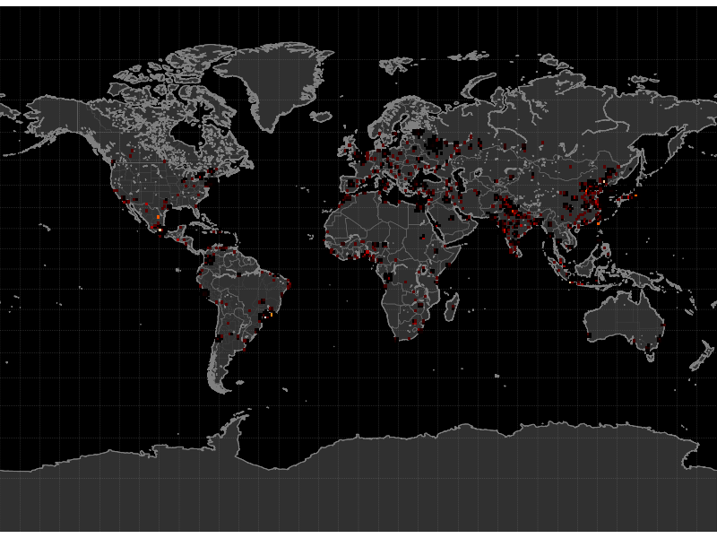
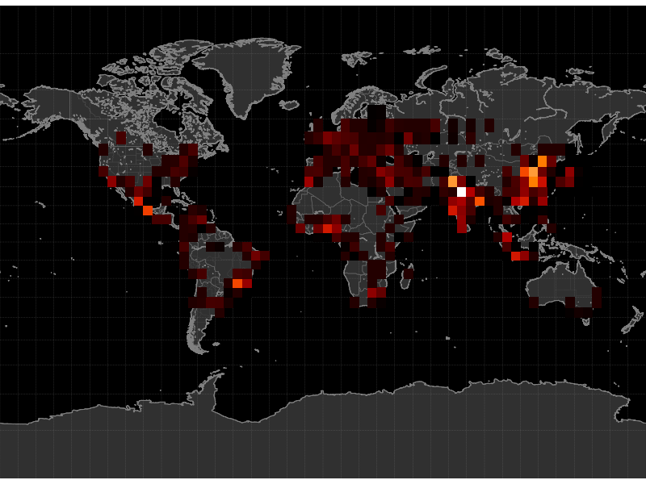
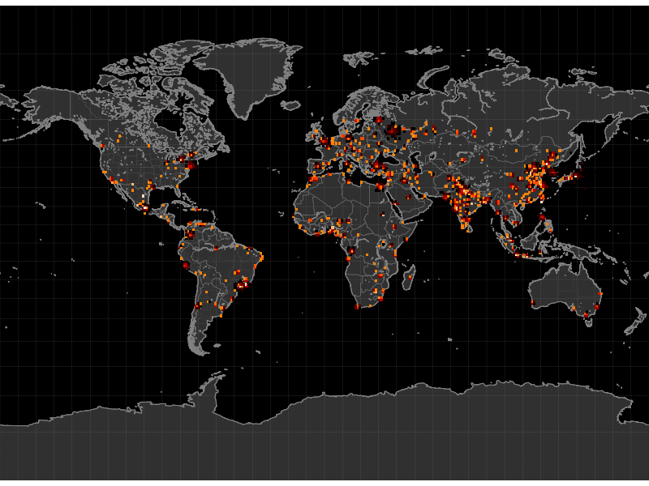
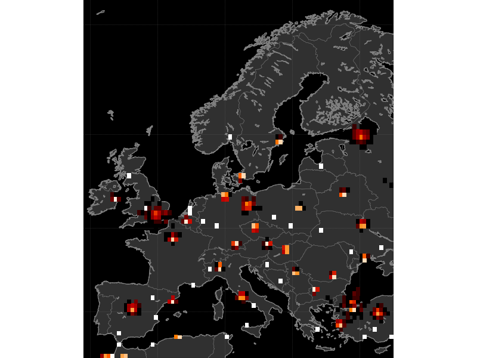
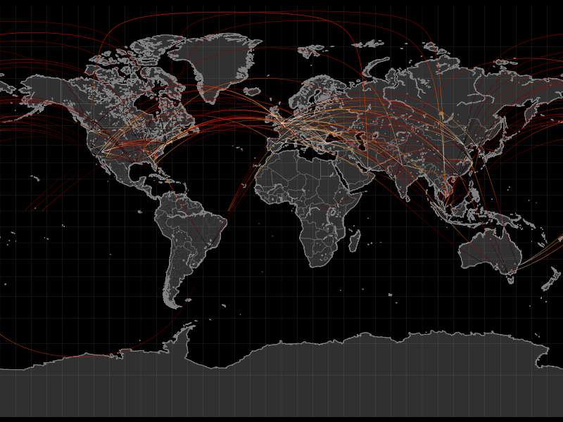
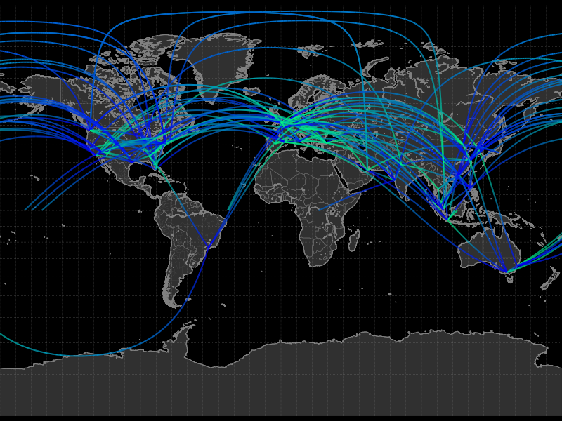
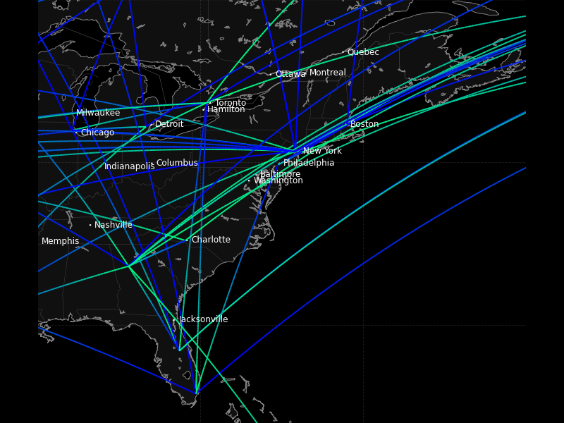
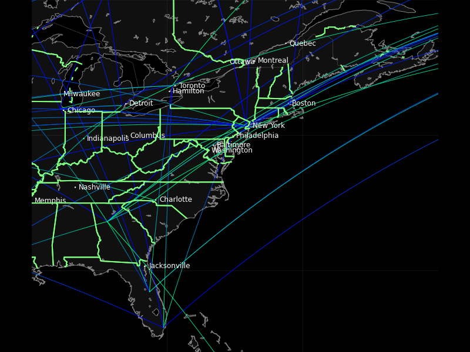

.. _Tracktable_Examples:

========
Examples
========

To help you get started using Tracktable we have included sample data
files and scripts to render a heatmap, a trajectory map and a
trajectory movie.  You will need to have ffmpeg installed to render
movies.  The heatmap and trajectory map will work with or without
ffmpeg.

All of these scripts will be run from the command line.  Before you
begin you should build Tracktable (see :ref:`Tracktable_Installation`) and
make sure its tests run successfully.

In the examples below we assume that ``TRACKTABLE`` is the root of the
Tracktable Python source code.  This is either
``...SOURCE_DIR/tracktable/Python/tracktable`` when running from the source tree
or ``...INSTALL_DIR/Python/tracktable`` if installed elsewhere.  We
further assume that ``python`` is whichever Python executable you
specified at build time.

--------------
Before You Run
--------------

Before you can run the scripts below you have to tell Python (and
possibly your operating system) where to find the Tracktable
libraries.  This involves modifying two environment variables.  You
should only modify them for your own account -- it's not necessary (or
especially helpful) to change the values system-wide.

1.  ``PYTHONPATH``

    Tell the Python interpreter to search the Tracktable Python
    directory for its libraries.  To do this, add all but the last
    component of the ``TRACKTABLE`` directory we described above to the
    environment variable ``PYTHONPATH``.  For example, if your Tracktable
    directory is ``/home/wilson/src/tracktable/Python/tracktable``, you
    would add ``/home/wilson/src/tracktable/Python`` to ``PYTHONPATH``.
    It doesn't matter whether or not you include the trailing slash.

    If you haven't done this, Python will throw an error similar to
    "ModuleNotFoundError: No module named 'tracktable'" when you try
    to do anything that involves Tracktable, including running the
    examples below.

2.  System path

    Besides the Python code, you will probably have to add the
    location of the Tracktable compiled libraries to your library
    search path.  This path is stored in the environment variable
    ``PATH`` on Windows, ``LD_LIBRARY_PATH`` on Linux (and most Unix
    variants) and ``DYLD_LIBRARY_PATH`` on Mac OS X.  The value to add
    to your path differs depending on whether you are running
    Tracktable from an installation (i.e. you typed 'make install'
    after building or installed Tracktable from a binary package) or
    from the source tree (i.e. you have not typed 'make install' or
    anything similar).

    **Install tree**: Suppose that you have installed Tracktable in
    ``/usr/local/tracktable``.  Add the path
    ``/usr/local/tracktable/lib`` to your library search path.

    **Source tree**: Suppose that your build directory (which you
    specified when you ran ``cmake``) is
    ``/home/wilson/src/tracktable/build``.  Add the directory
    ``/home/wilson/src/tracktable/build/lib`` to your library search
    path.  Be sure to replace ``/home/awilson/tracktable/build`` with
    the actual build directory that you used.

    If you haven't done this, Python will usually complain that it can't
    import something from the ``core_types`` module.

    If you still see errors about ``core_types`` after fixing this,
    make sure your Boost libraries are also on your library search
    path.

    **Note for OS X**: If you built Tracktable with the system default
     Python interpreter instead of installing Anaconda or similar, the
     operating system will ignore any changes you have made to your
     library search path.  This happens because of a change made to
     the operating system starting with 10.11 (El Capitan) called
     System Integrity Protection.  We are working on a fix for this
     but for the moment the best approach is to use a third-party
     Python installation.
    
.. _heatmap-example:

-----------------------------------
Terrestrial Heat Map (2D Histogram)
-----------------------------------

The simplest display type that Tracktable supports is the
2-dimensional histogram or `heatmap
<http://en.wikipedia.org/wiki/Heat_map>`_.  It requires points that
contain longitude/latitude coordinates.  The points can contain any
number of other attributes but they will be ignored.

Run the example as follows::

   $ python -m "tracktable.examples.heatmap_from_points" TRACKTABLE/examples/data/SampleHeatmapPoints.csv HeatmapExample1.png

Open the resulting image (``HeatmapExample1.png``) in your favorite
image viewer.  You will see a map of the Earth with a smattering of
red and yellow dots.  These are our example points, all generated in the
neighborhood of population centers.

Now it's time to change things around.  Let's suppose that you want to
see larger-area patterns with a coarser distribution.  You can change
the histogram resolution with the ``--histogram-bin-size`` argument::

   $ python -m "tracktable.examples.heatmap_from_points" --histogram-bin-size 5 TRACKTABLE/examples/data/SampleHeatmapPoints.csv HeatmapExample2.png

Perhaps when you open up that image you find that the bins are now too
large.  The earlier size was good but the histogram is too sparse.  If
you change the color map to use a logarithmic scale instead of a
linear one you might get more detail::

   $ python -m "tracktable.examples.heatmap_from_points" --scale logarithmic TRACKTABLE/examples/data/SampleHeatmapPoints.csv HeatmapExample3.png

That doesn't help much.  What if we zoom in on Europe and make the
bins smaller? ::

   $ python -m "tracktable.examples.heatmap_from_points" --scale logarithmic --map europe --histogram-bin-size 0.5 TRACKTABLE/examples/data/SampleHeatmapPoints.csv HeatmapExample4.png

There are many more options that you can change including map region,
point domain (geographic or Cartesian), decoration, colors, image
resolution and input configuration.  You can get a full list of
options with the ``--help`` argument::

   $ python -m "tracktable.examples.heatmap_from_points" --help

.. _trajectory-map-example:

--------------------------
Terrestrial Trajectory Map
--------------------------

As soon as we add timestamps to our (longitude, latitude) points we
can sensibly assemble sequences of points into trajectories.
Trajectories lend themselves to being plotted as lines on a map.
That's our second example.  We have provided a sample data set of
trajectories between many of the world's busiest airports for you to
use. ::

   $ python -m "tracktable.examples.trajectory_map_from_points"
       TRACKTABLE/examples/data/SampleTrajectories.csv
       TrajectoryMapExample1.png

The trajectories are colored according to the 'progress' feature that
ranges from 0 at the beginning of a trajectory to 1 at its end.
However, the thin lines make them difficult to see with this
resolution and color map.  Let's make the lines for the trajectories
wider and change the color map. ::

   $ python -m "tracktable.examples.trajectory_map_from_points"
       --trajectory-linewidth 2
       --trajectory-colormap winter
       TRACKTABLE/examples/data/SampleTrajectories.csv
       TrajectoryMapExample2.png

Just for the sake of argument, let's zoom in on the eastern US.  We
don't have a predefined map for that but we can come up with a
bounding box.  We want the region from (-90, 24) to (-60, 50).  Recall
that in our longitude-first convention that's (90W, 24N) to (60W,
50N).  While we're at it, let's also draw and label every city with a
population over half a million people. ::

   $ python -m "tracktable.examples.trajectory_map_from_points"
       --trajectory-linewidth 2
       --trajectory-colormap winter
       --map custom
       --map-bbox -90 24 -60 50
       --draw-cities-larger-than 500000
       TRACKTABLE/examples/data/SampleTrajectories.csv
       TrajectoryMapExample3.png

Last and not least, let's highlight the borders of the US states and
Canadian provinces in bright green lines 2 points wide.  We'll also
decrease the trajectory width so that the city labels aren't so
overwhelmed.  Don't forget the backslash (\) in front of the color. ::

   $ python -m "tracktable.examples.trajectory_map_from_points"
       --state-color \#80FF80
       --state-linewidth 2
       --trajectory-linewidth 1
       --trajectory-colormap winter
       --map custom
       --map-bbox -90 24 -60 50
       --draw-cities-larger-than 500000
       TRACKTABLE/examples/data/SampleTrajectories.csv
       TrajectoryMapExample3.png

This result is not going to win any beauty contests but you've now
seen a few more options available to you.  Tracktable allows you to
change the presence, appearance and style of boundaries for
continents, countries and states (US/Canada only at present).  You can
filter and draw city locations by population (given some minimum
threshold) or by ranking.  You can change the line style, appearance
and color map for the rendered trajectories.  All of this is explained
in the :ref:`Tracktable_User_Guide` and the
:ref:`Reference Documentation <tracktable_reference_label>`.

Cartesian Trajectory Map
^^^^^^^^^^^^^^^^^^^^^^^^

Since the addition of point domains in Tracktable 0.8 we can use the
same rendering code that draws on maps of the world to draw data in
flat 2D Cartesian space.  You need to specify `--domain cartesian2d`
and `--map-bbox x y X Y` as follows::

    $ python -m "tracktable.examples.trajectory_map_from_points"
         --object-id-column 0
         --timestamp-column 1
         --x-column 2
         --y-column 3
         --delimiter ,
         --map-bbox -100 -100 100 100
         --domain cartesian2d
         TRACKTABLE/examples/data/SamplePointsCartesian.csv
	 trajectory_map_cartesian.png

Support for automatically determining the bounding box of the data and
adding an appropriate margin is coming soon.

Movies
------

To render a movie, we render short subsets of trajectories over and
over.  As such we can re-use all of the arguments and algorithms we
already have for rendering trajectory maps with just a few additions
for movie duration, frames per second, and trajectory length.

Terrestrial Movie
^^^^^^^^^^^^^^^^^

We'll begin with a short movie (10 seconds long, 10 frames per second)
where each moving object has a trail showing the last hour of its
motion::

   $ python -m "tracktable.examples.movie_from_points" 
        --trail-duration 3600 
        --trajectory-linewidth 2 
        --fps 10 
        --duration 10 
        TRACKTABLE/examples/data/SampleTrajectories.csv 
        MovieExample1.mp4

This will encode a movie using vanilla MPEG4 that should be playable by
anything less than ten years old.  `Quicktime Player
<http://www.apple.com/quicktime/download/>`_, `iTunes <http://www.apple.com/itunes>`_, and `Windows Media Player <http://windows.microsoft.com/en-us/windows/download-windows-media-player>`_
can all handle this.  If you don't already have `VLC <http://www.videolan.org>`_ installed we recommend that as well.

We have two more features to demonstrate here.  First, instead of having the trajectory lines be of constant width along their length we can have them taper as they get older.  We do this with ``--trajectory-width taper``, ``trajectory-initial-linewidth`` and ``trajectory-final-linewidth``.  We will also put a dot at the head of each trajectory with ``--decorate-trajectory-head`` and ``trajectory-head-dot-size``. ::

   $ python -m "tracktable.examples.movie_from_points"
      --trail-duration 3600
      --trajectory-linewidth taper
      --trajectory-initial-linewidth 3
      --trajectory-final-linewidth 0
      --decorate-trajectory-head
      --trajectory-head-dot-size 3
      --fps 10
      --duration 10
      TRACKTABLE/examples/data/SampleTrajectories.csv MovieExample2.mp4

Too Many Arguments!
-------------------

Response files are used for managing siutations where many command line arguments need to be used. The use of of these files is documented in the user guide (see :ref:`Tracktable_User_Guide`).

Cartesian Movie
^^^^^^^^^^^^^^^

As with geographic data, we can also make movies from data in flat Cartesian space::

    $ python -m "tracktable.examples.movie_from_points"

      --domain cartesian2d
      --object-id-column 0
      --timestamp-column 1
      --x-column 2
      --y-column 3
      --delimiter ,
      --map-bbox -100 -100 100 100
      --trajectory-linewidth taper
      --trajectory-initial-linewidth 4
      --trajectory-final-linewidth 1
      TRACKTABLE/examples/data/SamplePointsCartesian.csv
      MovieExample3.mp4

NOTE: The trails won't appear in the movie until several seconds in.
This is not a bug.  Recall that trails are colored by their progress
from start to finish and the default colormap ("heat") is black at the
beginning.  If you would like to see them bright and vivid right from
the start, add an argument like ``--trajectory-colormap prism`` (or
any other Matplotib colormap you like).
=======
      example_cartesian_trajectory_movie.m4v

>>>>>>>  (1) Some filenames changed that didn't propagate to the documentation. (2) Some module dependencies must have changed over time as directory structures changed.
