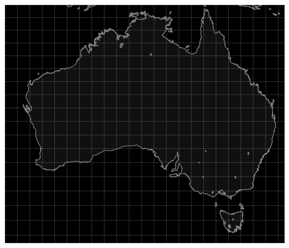
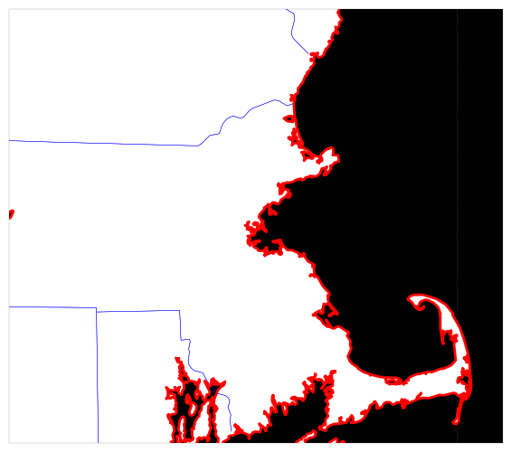
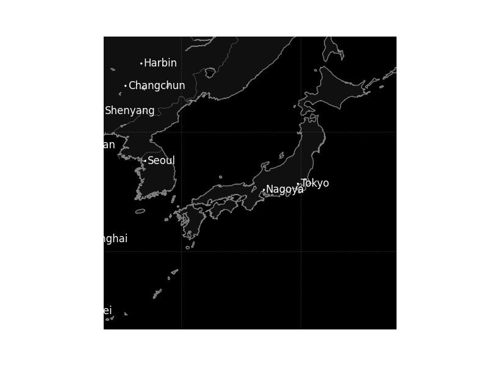
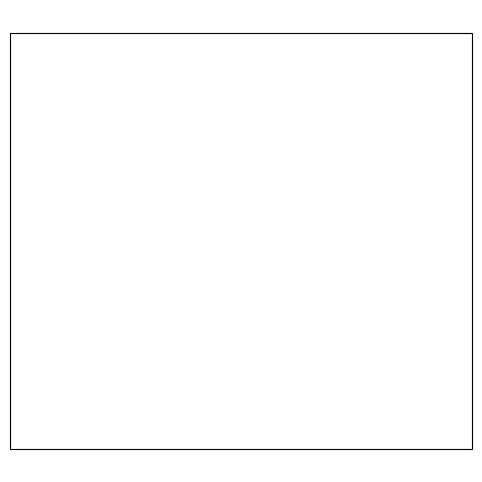

.. _user-guide-python-rendering:

=========
Rendering
=========

Now we come to the fun part of Tracktable: making images and movies from data.

Tracktable supports three kinds of visualization:

1. A heatmap (2D histogram)
2. A trajectory map (lines/curves drawn on the map)
3. A trajectory movie

.. note:: Visualization in tracktable can be static or interactive
   depending on the backend selected for ``render_trajectories``,
   cartopy or folium respectively.

.. note:: We render heatmaps directly from points. Trajectory maps and movies
   require assembled trajectories.

In all cases we render points into a 2D projection. In this section of the
user's guide we will discuss rendering onto a map projection. The
procedure for rendering points in Cartesian space is very similar and
will be documented Real Soon Now.

We use the `Cartopy <http://scitools.org.uk/cartopy>`_ toolkit for the
map projection and `Matplotlib <http://matplotlib.org>`_ for the
actual rendering.

.. note:: In order to view the images being rendered, either output the image to a file,
   execute the code in a notebook, or otherwise ensure your environment can launch an
   image viewing application.

.. _userguide-python-setting-up-map:

----------------
Setting Up a Map
----------------

The easiest way to create and decorate a map is with the
:py:func:`tracktable.render.render_map.render_map` function. It can
create maps of common (named) areas of the world, regions surrounding
airports, and user-specified regions.

.. _user-guide-python-region-map:

Predefined Region Map
---------------------

Here's an example that will create a map of Australia with coastlines
and longitude/latitude graticules rendered every 2 degrees.

.. code-block:: python
   :linenos:

   from tracktable.render.render_map import render_map
   from matplotlib import pyplot

   f = pyplot.figure(figsize=(8, 6), dpi=100)

   (mymap, initial_artists) = render_map(domain='terrestrial',
                                        map_name='region:australia',
                                        draw_coastlines=True,
                                        draw_countries=False,
                                        draw_states=False,
                                        draw_lonlat=True,
                                        lonlat_spacing=2,
                                        lonlat_linewidth=0.5)

We always return two values from ``render_map``. The first is the
:py:class:`cartopy.mpl.geoaxes` instance that will convert
points between world coordinates (longitude/latitude) and map
coordinates. The second is a list of Matplotlib :py:class:`artists <matplotlib.artist.Artist>`
that define all the decorations added to the map.

There are several predefined map areas. Their names can be retrieved
by programmatically calling :py:func:`tracktable.render.maps.available_maps()`
and for the convience of the user guide these maps are:

* ``region:conus``
* ``region:europe``
* ``region:world``
* ``region:north_america``
* ``region:south_america``
* ``region:australia``

.. hint:: If you would like to have a region included please send us its name and
   longitude/latitude bounding box. We will gladly add it to the next Tracktable release.
   Contact us using the contact information listed under the
   :ref:`Tracktable Contacts <tracktable_contacts>`

   This map of Australia was generated by passing the map name
   ``australia`` to ``render_map``.

.. _user-guide-python-airport-map:

Predefined Airport Map
----------------------

This next example will render a 200x200 km area around Boston's Logan
International Airport (BOS). Coastlines will be drawn with an extra-thick
(2-point-wide) red line. US state borders will be drawn in blue.
Land will be filled in using solid white. We use high-resolution
borders since we're zoomed in fairly far.

.. code-block:: python
   :linenos:

   from tracktable.render.render_map import render_map
   from matplotlib import pyplot

   f = pyplot.figure(figsize=(8, 6), dpi=100)
   (mymap, initial_artists) = render_map(domain='terrestrial',
                                        map_name='airport:BOS',
                                        draw_coastlines=True,
                                        draw_countries=False,
                                        draw_states=True,
                                        draw_lonlat=True,
                                        lonlat_spacing=2,
                                        lonlat_linewidth=0.5,
                                        land_fill_color='white',
                                        coastline_color='red',
                                        coastline_linewidth=2,
                                        state_color='blue',
                                        state_linewidth=1,
                                        region_size=(200, 200))

   This map of the area around Boston's Logan International Airport was generated by
   passing the map name ``airport:BOS`` to ``render_map``.

.. note:: The resolution of the borders in the generated image can be increased or
   decreased by setting the ``country_resolution``, ``state_resolution``, ``coastline_resolution``,
   ``land_resolution``, ``ocean_resolution`` and ``lake_resolution`` parameters.

.. _user-guide-python-city-map:

Predefined City Map
-------------------

.. note:: This functionality will be implemented in a future release.

.. _user-guide-python-custom-map:

Custom Map
----------

If we want a map that does not correspond to any of the predefined
ones then we can use the 'custom' map type. This example will create
a map of Japan and the Korean Peninsula with all cities labeled whose
population is larger than 2 million.

.. code-block:: python
   :linenos:

   from tracktable.render.render_map import render_map
   from matplotlib import pyplot

   f = pyplot.figure(figsize=(8, 6), dpi=100)

   # Bounding box is [longitude_min, latitude_min, longitude_max, latitude_max]
   (mymap, initial_artists) = render_map(domain='terrestrial',
                                        map_name='custom',
                                        map_bbox = [123.5, 23.5, 148, 48],
                                        draw_cities_larger_than=2000000)

   This map was generated by passing the map name ``custom`` and a
   longitude/latitude bounding box to ``render_map``.

.. note:: To define a map area that crosses the discontinuity at
          longitude +/- 180 degrees, use coordinates that wrap around
          beyond 180. The bounding boxes (-200, 0, -160, 40) and
          (160, 0, 200, 40) both define a region that extends from 0
          to 40 degrees latitude and 20 degrees to either side of 180
          degrees longitude.

.. _user-guide-python-cartesian-map:

Cartesian
---------

Similar to the terrestrial maps described above Tracktable contains the
ability to render map projections in the Cartesian domain. The example below
will generate a blank cartesian2d that can be filled with points or
trajectories.

.. code-block:: python
   :linenos:

   from tracktable.render.render_map import render_map
   from matplotlib import pyplot

   f = pyplot.figure(figsize=(8, 6), dpi=100)

   (mymap, initial_artists) = render_map(domain='cartesian2d',
                                        map_name='custom',
                                        map_bbox = [-100, -100, 100, 100])

   This map was generated by passing the domain ``cartesian2d``,
   map name ``custom`` and a longitude/latitude bounding box to ``render_map``.

.. _user-guide-python-rendering-on-map:

----------------------
Rendering Onto the Map
----------------------

Since Tracktable uses `Matplotlib <http://matplotlib.org>`_ as its
underlying renderer you can immediately render almost anything you
want on top of a map. Remember, however, that Matplotlib does not
know about the map projection. In order to draw things that will be
properly registered onto the map you need to use the
:py:class:`cartopy.mpl.geoaxes` instance that we
got earlier when we set up our map using ``render_map``. By calling the map
instance as if it were a function you can convert coordinates from
world space (longitude/latitude) to axis space (arbitrary coordinates
established by Matplotlib).

There are many ways to draw things like contours, points, curves,
glyphs and text directly onto the map. Please refer to the `cartopy
example gallery <https://scitools.org.uk/cartopy/docs/latest/gallery/index.html>`_ for
demonstrations. Tracktable provides code to render two of the most
common use cases for trajectory data: heatmaps (2D histograms) and
trajectory maps.

.. _user-guide-python-heat-maps:

Heat Maps
---------

A *heat map* (`Wikipedia page
<http://en.wikipedia.org/wiki/Heat_map>`_) is a two-dimensional
histogram -- that is, a density plot. We use heat maps to illustrate
the density of points that compose a set of trajectories. We are
typically looking for areas of high traffic and areas of coverage.

This release of Tracktable supports heat maps rendered on top of
geographic maps using the
:py:class:`tracktable.render.histogram2d.geographic` class. You
must call it with at least two arguments -- a
:py:class:`cartopy.mpl.geoaxes`
instance and an iterable of points. Other optional arguments
will let you control the histogram bin size,
color map and where on the map the heatmap is rendered.

A start-to-finish example of how to load points and render
a heat map can be found on the :ref:`heatmap example page <Python_Heatmap_Example>`.

.. note:: The :py:class:`tracktable.render.histogram2d.geographic`
          heat map generator only traverses its input data once to keep memory
          requirements low. You can safely use it with point sets too
          large to load into memory at once.

.. _user-guide-python-trajectory-maps:

Trajectory Maps
---------------

A *trajectory map* is an ordinary map with one or more trajectories
drawn on it. We may want to decorate a trajectory with any of the
following:

* Colors defined as a function of some quantity computed for the
  trajectory such as speed, turn rate or altitude
* Variable line widths (such as a trajectory that is broad at its head
  and narrow at its tail)
* A dot of some color and size at the head of the trajectory to mark
  the object's actual position
* A label at the head of the trajectory to display an object ID

All of this is packaged into the function :py:func:`draw_traffic <tracktable.render.paths.draw_traffic>`
in the :py:mod:`tracktable.render.paths` module.

.. note:: The argument names for that function are slightly
          misleading. Pay careful attention to the documentation for
          that function. Specifically, the arguments
          ``trajectory_linewidth_generator`` and
          ``trajectory_scalar_generator`` seem to indicate by their
          names that you must compute the linewidths and scalars at
          render time. This is fine for single images. For movies,
          we find it more useful to compute as much as we can before
          rendering and then pass an accessor function in as the
          generator.

Similar to :ref:`heat maps <user-guide-python-heat-maps>`, a start-to-finish example
on how to load points and generate trajectory maps can be found on the
:ref:`trajectory map example page <Python_Trajectory_Map_Example>`.

-------------
Making Movies
-------------

To a first approximation, making a movie is the same as making a
single image many, many times. The part that takes some care is
minimizing the number of times we perform expensive operations such as
loading data and configuring/decorating a map.

As with :ref:`heat maps <user-guide-python-heat-maps>` and
:ref:`trajectory maps <user-guide-python-trajectory-maps>` a
start-to-finish example how to load points and generate
trajectory movies can be found on the
:ref:`movie rendering example page <Python_Tracktable_Movie_Example>`.
